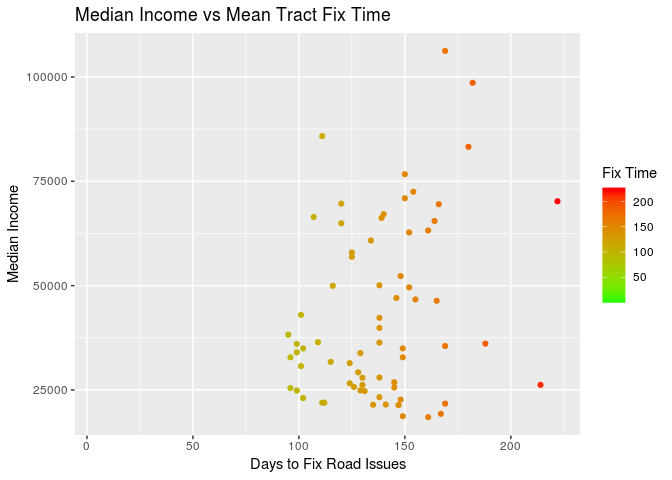

Final Project
================
Jude Canady, Cameron Navero

``` r
apiEndpoint <- 'https://data.brla.gov/resource/uqxt-dtpe.csv?'

query <- "$where=createdate between '2015-12-31' and '2018-10-26'"

dt_311 <- read.socrata(paste0(apiEndpoint, query), app_token = token[['app']])
dt_311 <- as_tibble(dt_311)

dt_311 <- dt_311 %>% 
  mutate(geolocation = str_extract_all(geolocation, '[-,.,0-9]+')) %>% 
  mutate(long = map_chr(geolocation, 1), lat = map_chr(geolocation, 2)) %>% 
  mutate_at(vars(long, lat), as.double) 
```

Research Question
=================

Does the median income of an area affect the fix time of road related issues in Baton Rouge?

Data Sources
============

The final data table comes from three sources: the United States Census Bureau, Data USA, and OpenBR.

The original column names of the US Census shape file are STATEFP, COUNTYFP, TRACTCE, GEOID, NAME, NAMELSAD, MTFCC, FUNCSTAT, ALAND, AWATER, INTPTLAT, INTPTLON, geometry.

The original columns of the OpenBR 311 data set are cityname, closeddate, comments, createdate, crossname, department, deptdiv, deptdivid, division, geolocation, geolocation\_address, geolocation\_city, geolocation\_state, geolocation\_zip, id, lastaction, latitude, longitude, parentid, parenttype, status, statusdesc, streetaddress, streetname, streetnum, typeid, typename, long, lat

Data Cleaning
=============

The table was constructed by joining on the GEOID for Baton Rouge and was mutated to allow for the complaint fix time, which was calculated by subtracting the opening data from the closing date for each 311 report. From this point, the 311 dataset was filtered for the following issues, POTHOLE, CONCRETE ROAD REPAIRS NEEDED, ROADSIDE EROSION ISSUE, REPAIR A BROKEN STREET CURB, SHOULDER REPAIR NEEDED, ROAD STRIPING NEEDED, CAVE-IN/SINK HOLE (SEWER RELATED), ROADSIDE DRAINAGE ISSUE, ROAD BUCKLE/BLOWOUT/FAULT, MANHOLE ISSUE, GUARDRAIL ISSUES, STORMDRAIN ISSUES. An index and blank GEOID column were added to the table to reduce the difficulty of future joins.

``` r
road_issues <- filter(dt_311, typename == 'POTHOLE' | typename == 'CONCRETE ROAD REPAIRS NEEDED' |
                        typename == 'ROADSIDE EROSION ISSUE' | typename == 'REPAIR A BROKEN STREET CURB' |
                        typename == 'SHOULDER REPAIR NEEDED' | typename == 'ROAD STRIPING NEEDED' |
                        typename == 'CAVE-IN/SINK HOLE (SEWER RELATED)' | typename == 'ROADSIDE DRAINAGE ISSUE' |
                        typename == 'ROAD BUCKLE/BLOWOUT/FAULT' | typename == 'MANHOLE ISSUE' |
                        typename == 'GUARDRAIL ISSUES' | typename == 'STORMDRAIN ISSUES') %>%
  mutate(time_to_complete = closeddate - createdate)

road_issues <- road_issues %>% mutate(index=row_number(), GEOID = NA)
```

The tract data returned from Data USA is in JSON format. We extract the GEOID and median income for 2016 from all available tracts in Baton Rouge. This table is converted to a tibble, with column names year, GEOID, and median\_income.

<!-- format data -->
``` r
tract_data <- fromJSON("https://api.datausa.io/api/?sort=desc&show=geo&required=income&sumlevel=tract&year=2016&where=geo%3A16000US2205000")$data
tract_data[,2] <- substr(tract_data[,2],8,100)
tract_data <- as_tibble(tract_data)
colnames(tract_data)[(1:3)] <- c("year", "GEOID", "median_income")
```

The tract map is joined with the tract data from the API. The median income is converted to a numeric value in order to satisfy the requirements of the dollar\_format() function, which will be used later in the visulization step.

<!-- overwriting shape file with tract income data -->
``` r
br_tract_income_map <- br_tract_map %>% inner_join(tract_data, by="GEOID")
br_tract_income_map$median_income <- as.numeric(br_tract_income_map$median_income)
```

To determine which 311 reports fall within which tract, we use a built in function st\_intersects() from the sf library. It compares the lattitude and longitude of the 311 reports and the geometries of the shape file for Baton Rouge. For each report the GEOID column is updated to the corresponding tract GEOID.

<!-- find which point fall within each geometry -->
``` r
road_geom <- st_as_sf(road_issues, coords=c("long", "lat"))
st_crs(road_geom) <- 4269
st_crs(br_tract_income_map)<-4269
inside <- st_intersects(br_tract_income_map, road_geom)
count = 1

for (tract in inside) {
  geo_id <- br_tract_income_map[count,]$GEOID
  road_issues$GEOID[road_issues$index %in% tract] <- geo_id
  count <- count + 1
}
```

A mean tract fix time for each tract is created by grouping the 311 reports on the newly updated GEOID column. The reports with NA values are dropped from this table. The total number of reports for each tract is also calculated in this step. The resultant table is then joined with the Baton Rouge shape file data on GEOID to produce the final table, with the mean fix time reported in days.

``` r
mean_tract_fix_time <- road_issues %>% group_by(GEOID) %>%
  summarise(mean_tract_fix_time = mean(time_to_complete, na.rm=TRUE), num_reports = n()) %>% drop_na()

mean_tract_fix_time$mean_tract_fix_time <- day(seconds_to_period(mean_tract_fix_time$mean_tract_fix_time))

kable(mean_tract_fix_time %>% top_n(10))
```

| GEOID       |  mean\_tract\_fix\_time|  num\_reports|
|:------------|-----------------------:|-------------:|
| 22033000200 |                     126|           343|
| 22033001700 |                     161|           315|
| 22033003400 |                     102|           363|
| 22033003506 |                     138|           315|
| 22033003701 |                     125|           361|
| 22033003703 |                     120|           330|
| 22033003801 |                     125|           368|
| 22033003906 |                     154|           422|
| 22033004005 |                     152|           317|
| 22033004503 |                     116|           408|

``` r
br_tract_income_map <- inner_join(br_tract_income_map, mean_tract_fix_time, by="GEOID")
```

<!-- median income vs mean tract fix time correlation -->
``` r
cor_coeff_mean_tract <- cor(br_tract_income_map$mean_tract_fix_time,
                            br_tract_income_map$median_income, use="pairwise.complete.obs")
```

#### The Pearson correlation coefficient between the mean tract fix time and the median income is 0.2806752

``` r
# median income plot
ggplot() +
  geom_sf(data = br_tract_income_map, aes(fill=median_income)) +
  scale_fill_gradient(labels=dollar_format(), name="Median Income", low="green",high="red") +
  theme(axis.ticks=element_blank(), 
        axis.text=element_blank(),
        panel.background=element_blank()) +
  ggtitle("Median Income for Baton Rouge")
```


``` r
ggplot()+
  geom_point(data=br_tract_income_map, aes(x = mean_tract_fix_time, 
            y=median_income, colour = mean_tract_fix_time)) +
  labs(x = "Days to Fix Road Issues", y = "Median Income") + 
  labs(colour = "Fix Time") +
  scale_color_gradient2(mid="green",high="red", space ="Lab") +
  ggtitle("Mean Tract Fix Time vs Median Income")
```



``` r
ggplot() +
  geom_sf(data=br_tract_income_map, aes(fill=as.numeric(mean_tract_fix_time))) +
  scale_fill_continuous(name="Mean Tract Fix Time in Days", low="green", high="red") +
  theme(axis.ticks=element_blank(), 
        axis.text=element_blank(),
        panel.background=element_blank()) +
  ggtitle("Mean Tract Fix Time for Baton Rouge")
```


Similar to the process above, the median fix time is calculated for each tract with available data, along with the number of reports for each tract. The median fix time table is joined on GEOID with br\_tract\_income\_map to produce the final data table, with the median fix time reported in days.

``` r
median_tract_fix_time <- road_issues %>% group_by(GEOID) %>%
  summarise(median_tract_fix_time = median(time_to_complete, na.rm=TRUE), num_reports = n()) %>% drop_na()

median_tract_fix_time$median_tract_fix_time <- day(seconds_to_period(median_tract_fix_time$median_tract_fix_time))

kable(median_tract_fix_time %>% top_n(10))
```

| GEOID       |  median\_tract\_fix\_time|  num\_reports|
|:------------|-------------------------:|-------------:|
| 22033000200 |                        63|           343|
| 22033001700 |                        50|           315|
| 22033003400 |                        30|           363|
| 22033003506 |                        72|           315|
| 22033003701 |                        57|           361|
| 22033003703 |                        44|           330|
| 22033003801 |                        57|           368|
| 22033003906 |                        77|           422|
| 22033004005 |                        67|           317|
| 22033004503 |                        40|           408|

``` r
br_tract_income_map <- inner_join(br_tract_income_map, median_tract_fix_time, by="GEOID")
```

``` r
cor_coeff_median_tract <- cor(br_tract_income_map$median_tract_fix_time,
                              br_tract_income_map$median_income,use="pairwise.complete.obs")
```

#### The Pearson correlation coefficient between the median tract fix time and the median income is 0.2973699

``` r
ggplot()+
  geom_point(data=br_tract_income_map, aes(x = median_tract_fix_time, 
                                           y=median_income, colour = median_tract_fix_time)) +
  labs(x = "Days to Fix Road Issues", y = "Median Income") + 
  labs(colour = "Fix Time") +
  scale_color_gradient2(mid="green",high="red", space ="Lab") +
  ggtitle("Median Tract Fix Time vs Median Income")
```


``` r
ggplot() +
  geom_sf(data=br_tract_income_map, aes(fill=as.numeric(median_tract_fix_time))) +
  scale_fill_continuous(name="Median Tract Fix Time in Days", low="green", high="red") +
  theme(axis.ticks=element_blank(), 
        axis.text=element_blank(),
        panel.background=element_blank()) +
  ggtitle("Median Tract Fix Time")
```


Results and Issues
==================

\*\*\*\*\*Can your work on this?
